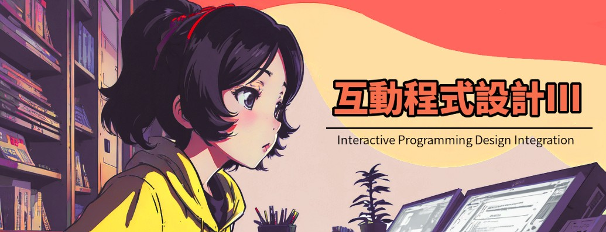

# Interactive-Programming-Design-II 【互動程式設計2】
Class Materials

在本課程當中，你會學到進階的C#遊戲編程知識。

由於課程密度較高，18週的課程只用到了原本規劃的8個講次內容。
後續課程若有機會再補上。

1. Data Collections
2. Message System
3. Multitasking
4. Advanced Class Design
5. Finite State Machine
6. Player Control (1)
7. Player Control (2)
8. AVG Machine

=== Below parts are under developement ===

9. Stat & Inventory UI
10. NPC AI
11. Weapons & Attack
12. Achievement System

Mr.Fu (傅子恒) 
臺北科技大學
2024
